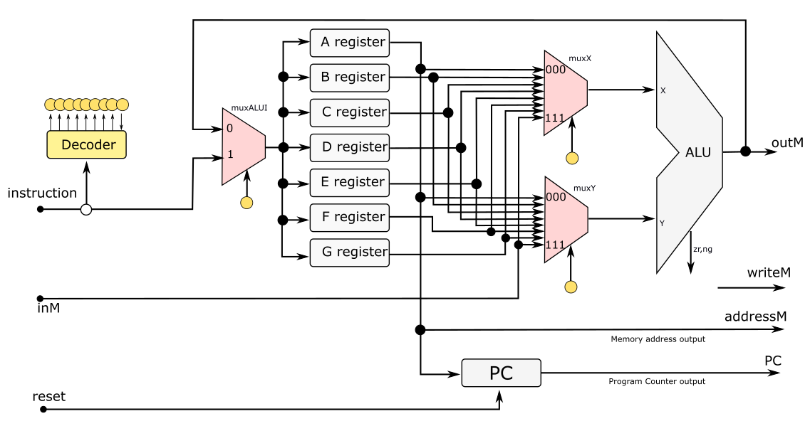
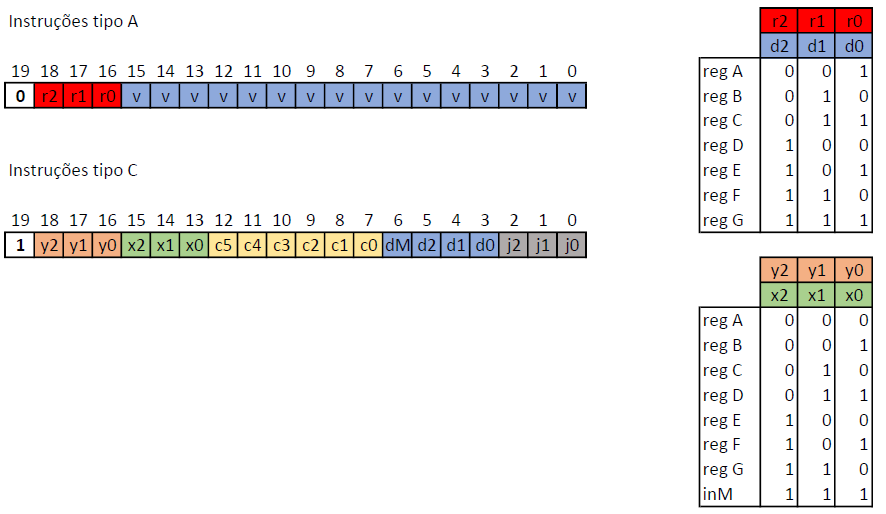
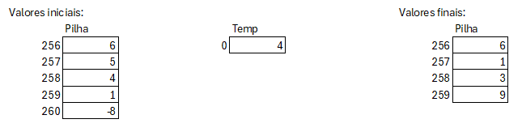

# Av4 - 2° Semestre de 2023


Avaliação 4 - Elementos de Sistemas

| Pontos HW | Pontos SW |
|:---------:|:---------:|
| 10        | 45        |

- Avaliação **individual**.
- **120 min** total.
- Ficar no blackboard durante a prova.
- Clonar o seu repositório (e trabalhar nele)
- Fazer **commit** ao final de cada questão.
- Lembre de dar **push** ao final.


**LEMBRE DE REALIZAR UM COMMIT (A CADA QUESTÃO) E DAR PUSH AO FINALIZAR**


## 1. Assembler - CPU modificada


| Pontos HW | Pontos SW |
|:---------:|:---------:|
| 0         | 20        |

Na questão da Av3, foi proposta uma modificação na CPU de forma a ter mais flexibilidade nas operações com a ULA. Para isso, foram incluidos registradores e os mux, como indicado na figura.
 

 


Dessa forma, o formato das instruções passará a ter 20 bits, conforme apresentado a seguir:



onde os bits r2 r1 r0 na instrução tipo A indica qual dos registradores irá carregar um valor a partir da instrução.
Para as instruções do tipo C, os vetores bits (x2 x1 x0) e (y2 y1 y0) selecionam os registradores ou a entrada da memória que serão usados na entradas X e Y da ULA. Já os bits d2 d1 d0 indicam em qual registrador o resultado da ULA será salvo. O valor d2d1d0 = "000" não salva o resultado da ULA em nenhum registrador. Já o bit dM indica o salvamento na memória RAM. Nesta versão da CPU, pode-se salvar em 1 registrador e na memória em um mesmo ciclo de clock.

Nesta questão, o objetivo é acrecentar uma nova instrução no Assembler para esta nova CPU.
A instrução é "cmp_jg" que compara dois números e faz o salto se a subtração entre eles for maior que zero.

Exemplo de sintaxe:

`cmp_jg %A, %B`
realize o salto se %A-%B for maior que zero.

`cmp_jg %A, %B, %C`
realize o salto se %A-%B for maior que zero e salva o valor da subtração em %C

`cmp_jg %A, %B, %C`, (%A)
realize o salto se %A-%B for maior que zero e salva o valor da subtração em %C e na memória.

### Implementação

Implemente o **Dest()** no arquivo `Assembler/src/main/java/assembler/Code.java`  para uma instrução **cmp_jg**, permitindo que o resultado da operação possa ser salvo nos registradores de %A a %G, além da memória.

Implemente o **Comp()** no arquivo `Assembler/src/main/java/assembler/Code.java` para uma instrução **cmp_jg**. Considere **apenas** as possíveis combinações que comecem com **cmp_jg %A** na CPU modificada.


### Testes

O teste deve ser executado através do arquivo **CodeTest.java**.


#### Rubrica para avaliação:

| Pontos SW | Descritivo                                                            |
|-----------|-----------------------------------------------------------------------|
| 10        | Função **dest()** caso **cmp_jg** implementada e passando nos testes  |
| 10        | Função **comp()** caso **cmp_jg** implementada e passando nos testes  |
| ?         | Implementações incompletas ou incorretas serão analisadas caso a caso |


## 2. VM - Vetor das diferenças


| Pontos HW | Pontos SW |
|:---------:|:---------:|
| 0         | 25        |

Queremos fazer um programa em VM que calcule as diferenças de um vetor de números que se encontra na pilha.

A memória `temp 0` armazena a quantidade de números no vetor.
    
### Implementação

Implemente a programação no arquivo `src/vm/codigo/Main.vm`.

Fique à vontade para criar funções adicionais.

Exemplo:



### Testes

```
./compileALL.py
SIM=ghdl pytest --tb=no -s
```

#### Rubrica para avaliação:

| Pontos SW | Descritivo                                                                   |
|-----------|------------------------------------------------------------------------------|
|  5        | Demonstrar conhecimento dos comandos básicos do VM utilizado                 |
| 10        | Demonstrar conhecimento de condicional no VM utilizado                       |
| 10        | Demonstrar conhecimento da utilização dos segmentos de memória               |


## 3. Álgebra Booleana

| Pontos HW | Pontos SW |
|:---------:|:---------:|
| 10        |           |

Considere o nosso computador Z01 feito durante as APSs. 

### Questão

Obtenha a expressão booleana simplificada em função de c0, c1, c2, c3, c4 e c5 que retorne '1' quando a operação indicada pelos 6 bits utilize os 2 registradores como operandos (5 últimas linhas da tabela na página Z01 -> Instruction Set). Nos demais casos, a função deve retornar '0'.

Escreva a expressão e **indique** como foi obtida no arquivo `src/expressao.txt`.

#### Rubrica para avaliação:

| Pontos HW | Descritivo                                                                   |
|-----------|------------------------------------------------------------------------------|
| 10        | Expressão obtida corretamente                      |
| ?         | Expressões incorretas serão analisadas caso a caso |